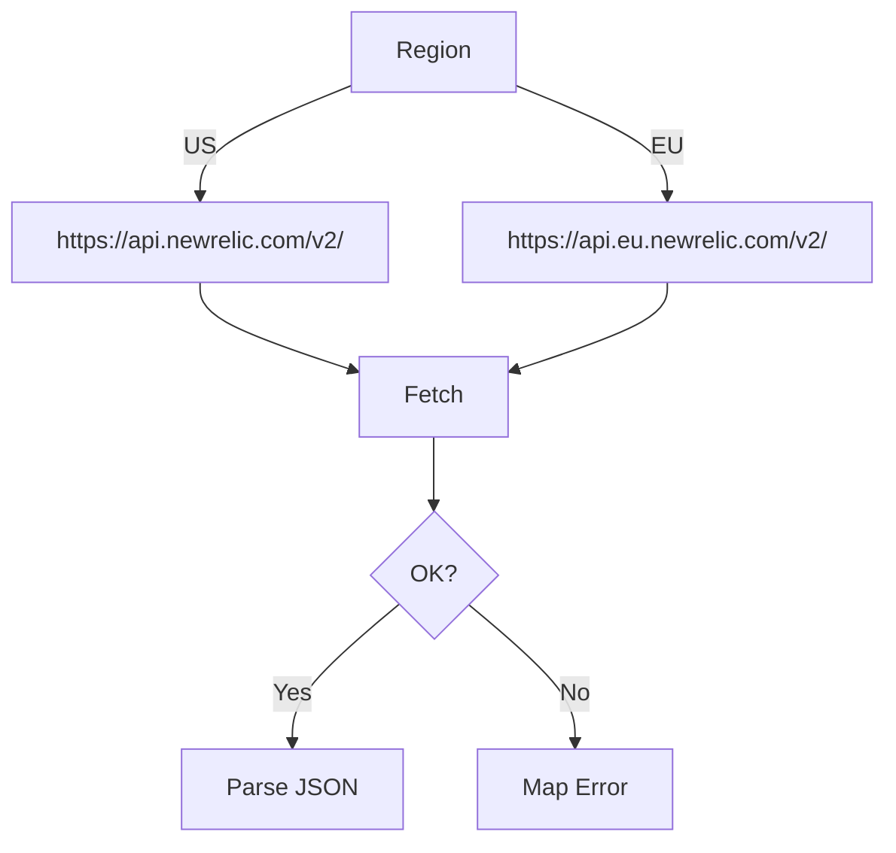

# Story: Shared REST v2 client (supporting library)

## Summary

Provide a small REST client used by all REST v2 tools for base URL selection, headers, and pagination handling.

## Features

- Region-aware base URL selection (US/EU)
- Auth headers (`Api-Key`, `Content-Type: application/json` as needed)
- RFC 5988 `Link` header parsing and pagination helpers
- Error mapping (401 unauthorized, others with status + snippet)
- Query serialization helpers (arrays like `names[]`, `values[]`)

## Zod schema (helper options)

```ts
import { z } from "zod";

export const RestClientOptions = z.object({
  apiKey: z.string().min(1),
  region: z.enum(["US", "EU"]).default("US"),
});
export type RestClientOptions = z.infer<typeof RestClientOptions>;
```

## Flow



## Acceptance criteria

- Single place to build URLs, set headers, follow pagination, and map common error classes (401/403/404/429).
- Reused by all REST tools.

## References

- Swagger/OpenAPI: `https://api.newrelic.com/docs/swagger.yml` [source](https://api.newrelic.com/docs/swagger.yml)
- RFC 5988 Links: `https://tools.ietf.org/html/rfc5988#section-5`
