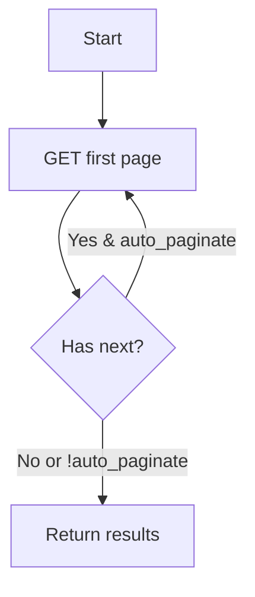

# Story: list_apm_applications (REST)

## Summary

List APM applications with simple filters via REST v2.

## Endpoint(s)

- GET `/applications.json`
- Base URLs: US `https://api.newrelic.com/v2/`, EU `https://api.eu.newrelic.com/v2/`

## Auth

- Header: `Api-Key: <USER_API_KEY>`

## Parameters

- `filter_name` (string, optional) — maps to `filter[name]`
- `filter_host` (string, optional) — maps to `filter[host]`
- `filter_ids` (number[], optional) — maps to `filter[ids]`
- `filter_language` (string, optional) — maps to `filter[language]`
- `page` (number, optional)
- `cursor` (string, optional) — if supported
- `auto_paginate` (boolean, default false, optional)
- `region` ("US" | "EU", default "US")

## Zod schema (tool input)

```ts
import { z } from "zod";

export const ListApmApplicationsParams = z.object({
  filter_name: z.string().optional(),
  filter_host: z.string().optional(),
  filter_ids: z.array(z.number().int().positive()).optional(),
  filter_language: z.string().optional(),
  page: z.number().int().positive().optional(),
  cursor: z.string().optional(),
  auto_paginate: z.boolean().default(false),
  region: z.enum(["US", "EU"]).default("US"),
});
export type ListApmApplicationsParams = z.infer<typeof ListApmApplicationsParams>;
```

## Pagination flow



## Acceptance criteria

- Builds query string with `filter[...]` params correctly.
- Follows pagination when `auto_paginate` is true using `Link` headers.
- Returns list of applications and pagination metadata.

## Test plan

- URL & query param construction tests.
- Pagination follow tests.
- Error handling tests.

## References

- Swagger/OpenAPI: `https://api.newrelic.com/docs/swagger.yml` [source](https://api.newrelic.com/docs/swagger.yml)

## Out of scope

- Application details/metrics (other tools cover metrics for hosts).
