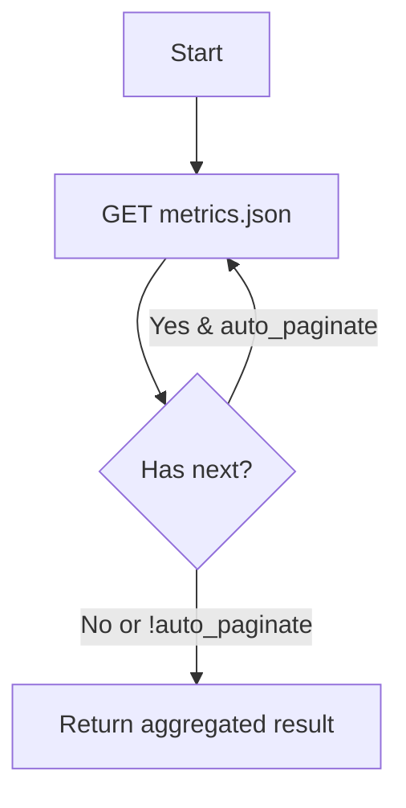

# Story: list_metric_names_for_host (REST)

## Summary

List metric names and value names for a specific application host.

## Endpoint(s)

- GET `/applications/{application_id}/hosts/{host_id}/metrics.json`
- Base URLs: US `https://api.newrelic.com/v2/`, EU `https://api.eu.newrelic.com/v2/`

## Auth

- Header: `Api-Key: <USER_API_KEY>`

## Parameters

- `application_id` (number, required)
- `host_id` (number, required)
- `name` (string, optional) — filter metric names
- `page` (number, optional)
- `auto_paginate` (boolean, default false, optional)
- `region` ("US" | "EU", default "US")

## Zod schema (tool input)

```ts
import { z } from "zod";

export const ListMetricNamesForHostParams = z.object({
  application_id: z.number().int().positive(),
  host_id: z.number().int().positive(),
  name: z.string().optional(),
  page: z.number().int().positive().optional(),
  auto_paginate: z.boolean().default(false),
  region: z.enum(["US", "EU"]).default("US"),
});
export type ListMetricNamesForHostParams = z.infer<typeof ListMetricNamesForHostParams>;
```

## Pagination flow



## Acceptance criteria

- Queries metrics names for a host, respecting filters and pagination.
- Returns list of metrics with value names and pagination metadata.

## Test plan

- Parameter validation and URL building tests.
- Pagination follow tests; error handling.

## References

- Swagger/OpenAPI: `https://api.newrelic.com/docs/swagger.yml` [source](https://api.newrelic.com/docs/swagger.yml)
