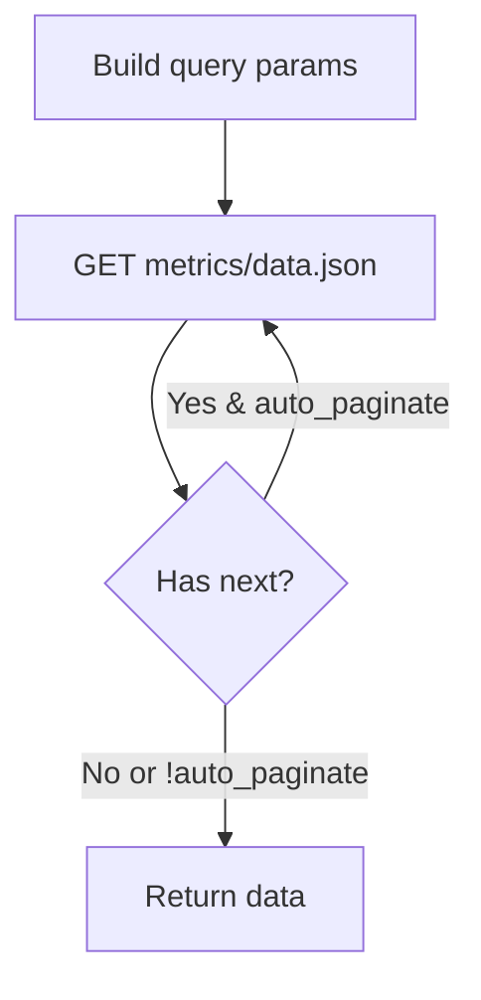

# Story: get_metric_data_for_host (REST)

## Summary

Retrieve timeslice metric data for selected metrics on a specific host.

## Endpoint(s)

- GET `/applications/{application_id}/hosts/{host_id}/metrics/data.json`
- Base URLs: US `https://api.newrelic.com/v2/`, EU `https://api.eu.newrelic.com/v2/`

## Auth

- Header: `Api-Key: <USER_API_KEY>`

## Parameters

- `application_id` (number, required)
- `host_id` (number, required)
- `names` (string[], required) — metric names
- `values` (string[], optional) — metric value keys
- `from` (string, optional ISO8601)
- `to` (string, optional ISO8601)
- `period` (number, optional seconds)
- `summarize` (boolean, optional)
- `page` (number, optional)
- `cursor` (string, optional)
- `auto_paginate` (boolean, default false, optional)
- `region` ("US" | "EU", default "US")

## Zod schema (tool input)

```ts
import { z } from "zod";

export const GetMetricDataForHostParams = z.object({
  application_id: z.number().int().positive(),
  host_id: z.number().int().positive(),
  names: z.array(z.string().min(1)).min(1),
  values: z.array(z.string().min(1)).optional(),
  from: z.string().optional(),
  to: z.string().optional(),
  period: z.number().int().positive().optional(),
  summarize: z.boolean().optional(),
  page: z.number().int().positive().optional(),
  cursor: z.string().optional(),
  auto_paginate: z.boolean().default(false).optional(),
  region: z.enum(["US", "EU"]).default("US"),
});
export type GetMetricDataForHostParams = z.infer<typeof GetMetricDataForHostParams>;
```

## Flow



## Acceptance criteria

- Correctly serializes array params (e.g., `names[]`, `values[]`).
- Supports time window params and summarization.
- Follows pagination when requested; returns combined timeslices.

## Test plan

- Query serialization tests for arrays and time params.
- Pagination follow tests.
- Error handling tests.

## References

- Swagger/OpenAPI: `https://api.newrelic.com/docs/swagger.yml` [source](https://api.newrelic.com/docs/swagger.yml)
