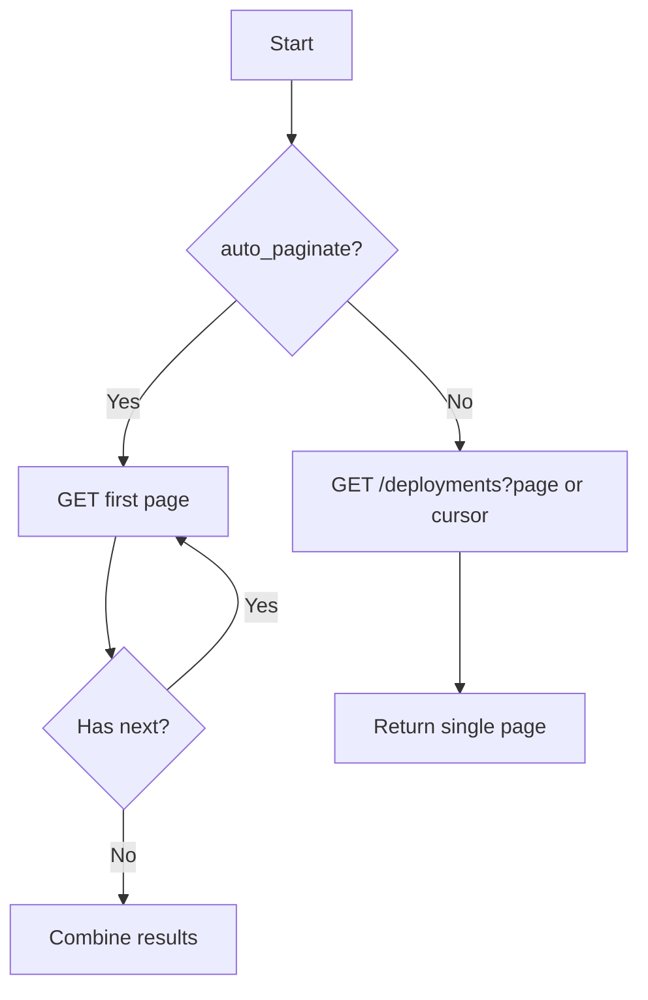

# Story: list_deployments (REST)

## Summary

List deployments for a specific APM application, with support for pagination.

## Endpoint(s)

- GET `/applications/{application_id}/deployments.json`
- Base URLs: US `https://api.newrelic.com/v2/`, EU `https://api.eu.newrelic.com/v2/`

## Auth

- Header: `Api-Key: <USER_API_KEY>` (User API Key)

## Parameters

- `application_id` (number, required)
- `page` (number, optional)
- `cursor` (string, optional) — if supported, replaces `page`
- `auto_paginate` (boolean, optional; default false)
- `region` ("US" | "EU", default "US")

## Zod schema (tool input)

```ts
import { z } from "zod";

export const ListDeploymentsParams = z.object({
  application_id: z.number().int().positive(),
  page: z.number().int().positive().optional(),
  cursor: z.string().optional(),
  auto_paginate: z.boolean().default(false),
  region: z.enum(["US", "EU"]).default("US"),
});
export type ListDeploymentsParams = z.infer<typeof ListDeploymentsParams>;
```

## Pagination flow

- Endpoint returns RFC 5988 `Link` headers; follow `rel="next"` until absent or `auto_paginate = false`.



## Acceptance criteria

- Sends GET with `Api-Key` header; chooses base URL by `region`.
- Supports both `page` and `cursor` when present.
- When `auto_paginate`, follows `Link: rel=next` and aggregates results.
- Returns array of deployments and pagination metadata (links, last cursor/page).
- Handles errors with clear messages.

## Test plan

- Unit tests for: URL building, pagination following, and error handling.
- Schema validation tests for invalid app id.

## References

- Swagger/OpenAPI: `https://api.newrelic.com/docs/swagger.yml` [source](https://api.newrelic.com/docs/swagger.yml)
- API Explorer guide: [Getting started with New Relic's API Explorer](https://docs.newrelic.com/docs/features/getting-started-with-new-relics-api-explorer)

## Out of scope

- Creating or deleting deployment records (separate stories).
