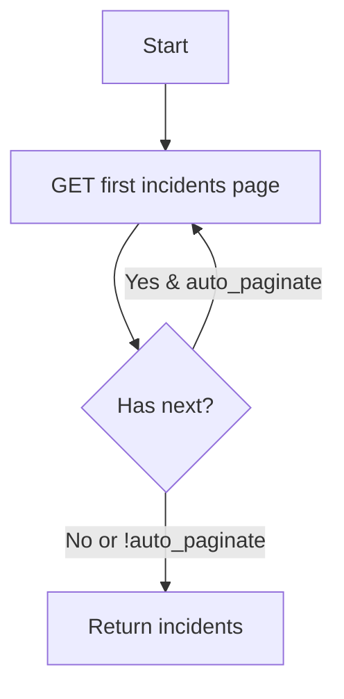

# Story: list_open_incidents (REST)

## Summary

List open alert incidents via REST v2.

## Endpoint(s)

- GET `/alerts_incidents.json` (supports `page` for pagination)
- Base URLs: US `https://api.newrelic.com/v2/`, EU `https://api.eu.newrelic.com/v2/`
  - Note: `only_open` and `priority` are not documented as server-side filters in REST v2; apply client-side filtering if needed.

## Auth

- Header: `Api-Key: <USER_API_KEY>`

## Parameters

- `only_open` (boolean, default true) — client-side filtering
- `priority` ("CRITICAL" | "HIGH" | "MEDIUM" | "LOW", optional) — client-side filtering
- `page` (number, optional)
- `auto_paginate` (boolean, default false)
- `region` ("US" | "EU", default "US")

## Zod schema (tool input)

```ts
import { z } from "zod";

export const ListOpenIncidentsParams = z.object({
  only_open: z.boolean().default(true),
  priority: z.enum(["CRITICAL", "HIGH", "MEDIUM", "LOW"]).optional(),
  page: z.number().int().positive().optional(),
  auto_paginate: z.boolean().default(false),
  region: z.enum(["US", "EU"]).default("US"),
});
export type ListOpenIncidentsParams = z.infer<typeof ListOpenIncidentsParams>;
```

## Pagination flow



## Acceptance criteria

- Returns incidents; if `only_open`/`priority` provided, apply client-side filtering. Include pagination metadata (Link rels and/or next page URL) when not auto-paginating.

## Test plan

- Filtering behavior and pagination handling.

## References

- Swagger/OpenAPI: `https://api.newrelic.com/docs/swagger.yml` [source](https://api.newrelic.com/docs/swagger.yml)
